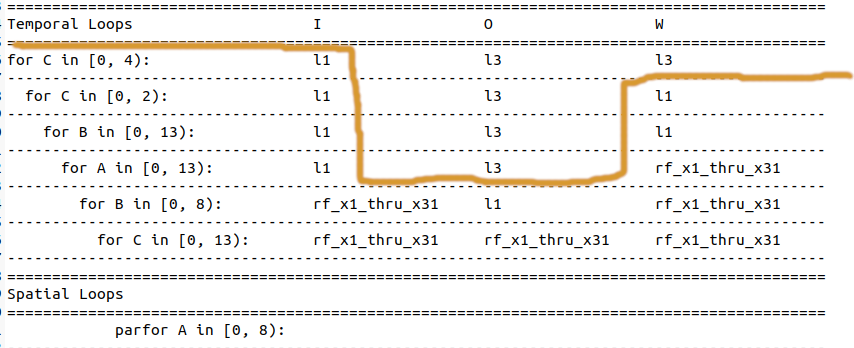

# What kinds of tiling does mlir-opt support?

0. make sure to set your environment variables correctly!
   ```
   export PATH=/home/hoppip/llvm-project-pistachio/build-riscv/bin:$PATH
   ```

   and for using `mlir-cpu-runner`, do

   ```
   export MLIR_CPU_RUNNER_LIBS=/home/hoppip/llvm-project-pistachio/build-riscv/lib/libmlir_c_runner_utils.so,/home/hoppip/llvm-project-pistachio/build-riscv/lib/libmlir_runner_utils.so
   ```

My laptop version...
```
export PATH=/home/emily/llvm-project-pistachio/build-riscv/bin:$PATH;
export MLIR_CPU_RUNNER_LIBS=/home/emily/llvm-project-pistachio/build-riscv/lib/libmlir_c_runner_utils.so,/home/emily/llvm-project-pistachio/build-riscv/lib/libmlir_runner_utils.so
```
## I. Setup

1. ```
   cd llvm-project-pistachio
   ```

2. ```
   mkdir build-riscv
   ```

3. ```
   cd build-rsicv
   ```

4. ```
   cmake -G Ninja ../llvm \
   -DLLVM_ENABLE_PROJECTS="mlir;clang;lld" \
   -DLLVM_BUILD_EXAMPLES=ON \
   -DLLVM_TARGETS_TO_BUILD="Native;NVPTX;AMDGPU;RISCV" \
   -DCMAKE_BUILD_TYPE=Debug \
   -DLLVM_USE_LINKER=lld \
   -DCMAKE_C_COMPILER=/usr/bin/clang \
   -DCMAKE_CXX_COMPILER=/usr/bin/clang++ \
   -DLLVM_ENABLE_ASSERTIONS=ON \
   -DLLVM_ENABLE_RTTI=ON
   ```

5. ```
   ninja -j 20
   ```

## II. Investigation

1. `mlir-opt --help | tile`:

   ```
   --affine-loop-tile                                     -   Tile affine loop nests
   --cache-size=<ulong>                                 - Set size of cache to tile for in KiB (default: 512)
   --separate                                           - Separate full and partial tiles (default: false)
   --tile-size=<uint>                                   - Use this tile size for all loops
   --tile-sizes=<uint>                                  - List of tile sizes for each perfect nest (overridden by -tile-size)
   --allocate-arm-sme-tiles                               -   Allocate SME tiles
   --parallel-loop-tile-sizes=<long>                    - Factors to tile parallel loops by
   --test-affine-parametric-tile                          -   Tile affine loops using SSA values as tile sizes
   --loop-type=<string>                                 - Specify the type of loops to generate: for, parallel or tiled_loop
   --peeled-loops=<long>                                - Loops to be peeled when test-tile-pattern
   --tile-sizes=<long>                                  - Linalg tile sizes for test-tile-pattern
   
   ```

`test-tile-pattern` is mentioned as part of test-linalg [../mlir/test/lib/Dialect/Linalg/TestLinalgTransforms.cpp](../mlir/test/lib/Dialect/Linalg/TestLinalgTransforms.cpp)

2. `mlir-opt --help | grep tiling`:

   ```
   --scf-parallel-loop-tiling                             -   Tile parallel loops
     --no-min-max-bounds                                  - Perform tiling with fixed upper bound with inbound check inside the internal loops
     --test-extract-fixed-outer-loops                       -   test application of parametric tiling to the outer loops so that the ranges of outer loops become static
   ```

3. `mlir-opt --help | grep linalg`:

   ```
         --convert-elementwise-to-linalg                        -   Convert ElementwiseMappable ops to linalg
         --convert-linalg-to-affine-loops                       -   Lower the operations from the linalg dialect into affine loops
         --convert-linalg-to-loops                              -   Lower the operations from the linalg dialect into loops
         --convert-linalg-to-parallel-loops                     -   Lower the operations from the linalg dialect into parallel loops
         --convert-linalg-to-std                                -   Convert the operations from the linalg dialect into the Standard dialect
         --convert-tensor-to-linalg                             -   Convert some Tensor dialect ops to Linalg dialect
         --linalg-bufferize                                     -   Bufferize the linalg dialect
         --linalg-detensorize                                   -   Detensorize linalg ops
         --linalg-fold-unit-extent-dims                         -   Remove unit-extent dimension in Linalg ops on tensors
         --linalg-fuse-elementwise-ops                          -   Fuse elementwise operations on tensors
         --linalg-generalize-named-ops                          -   Convert named ops into generic ops
         --linalg-inline-scalar-operands                        -   Inline scalar operands into linalg generic ops
         --linalg-named-op-conversion                           -   Convert from one named linalg op to another.
       =only-generic                                      -   Run only on linalg.generic operations.
       =except-generic                                    -   Run on operations expect linalg.generic (e.g., foreach)
         --test-linalg-data-layout-propagation                  -   Test data layout propagation
         --test-linalg-decompose-ops                            -   Test Linalg decomposition patterns
         --test-linalg-drop-unit-dims                           -   
         --test-linalg-elementwise-fusion-patterns              -   Test Linalg element wise operation fusion patterns
           --fuse-with-reshape-by-collapsing                    - Test linalg expand_shape -> generic fusion patterns that collapse the iteration space of the consumer
           --fuse-with-reshape-by-collapsing-control            - Test controlling the linalg expand_shape -> generic fusion patterns that collapse the iteration space of the consumer
         --test-linalg-greedy-fusion                            -   Test Linalg fusion by applying a greedy test transformation.
         --test-linalg-pad-fusion                               -   Test PadOp fusion
         --test-linalg-transform-patterns                       -   Test Linalg transformation patterns by applying them greedily.
           --test-bubble-up-extract-slice-op-pattern            - Test rewrite of linalgOp + extract_slice into extract_slice + linalgOp
           --test-linalg-to-vector-patterns                     - Test a set of patterns that rewrite a linalg contraction in vector.contract form
           --test-swap-extract-slice-with-fill-pattern          - Test patterns to swap tensor.extract_slice(linalg.fill())
         --tosa-to-linalg                                       -   Lower TOSA to LinAlg on tensors
         --tosa-to-linalg-named                                 -   Lower TOSA to LinAlg named operations
           --prefer-conv2d-kernel-layout-hwcf                   - Prefer generating linalg.conv_2d_nhwc_hwcf over linalg.conv_2d_nhwc_fhwc
         --test-lower-to-llvm                                   -   An example of pipeline to lower the main dialects (arith, linalg, memref, scf, vector) down to LLVM.
         --tosa-to-linalg-pipeline                              -   The default pipeline for converting TOSA operators to the equivalent operations using the tensor operations in LinAlg as well as LinAlg named operations.
   ```

4. `mlir-opt --help | grep transform`

   ```
         --affine-loop-normalize                                 -   Apply normalization transformations to affine loop-like ops
         --test-create-vector-broadcast                          -   Test optimization transformations for transfer ops
         --test-linalg-greedy-fusion                             -   Test Linalg fusion by applying a greedy test transformation.
         --test-linalg-transform-patterns                        -   Test Linalg transformation patterns by applying them greedily.
           --test-generalize-pad-tensor                          - Test transform pad tensor by copying with generic ops
           --test-generalize-tensor-pack                         - Test transform that generalizes pack ops into a sequence of tensor and Linalg ops
           --test-generalize-tensor-unpack                       - Test transform that generalizes unpack ops into a sequence of tensor and Linalg ops
         --test-loop-unrolling                                   -   Tests loop unrolling transformation
         --test-multi-buffering                                  -   Test multi buffering transformation
         --test-scf-parallel-loop-collapsing                     -   Test parallel loops collapsing transformation
           --annotate                                            - Annote operations during loop pipelining transformation
         --test-tensor-transform-patterns                        -   Test Tensor transformation patterns by applying them greedily.
           --test-tracking-listener                              - Test tensor TrackingListener for the transform dialect
           --tile-consumer-and-fuse-producer-using-scf-for       - Test tile and fuse transformation using TilingInterface with scf.for operations
           --tile-consumer-fuse-and-yield-producer-using-scf-for - Test tile and fuse transformation while yielding fused producer replacements using TilingInterface with scf.for operations
         --test-transform-dialect-erase-schedule                 -   erase transform dialect schedule from the IR
         --test-transform-dialect-interpreter                    -   apply transform dialect operations one by one
           --debug-payload-root-tag=<string>                     - Select the operation with 'transform.target_tag' attribute having the given value as payload IR root. If empty select the pass anchor operation as the payload IR root.
           --debug-transform-root-tag=<string>                   - Select the operation with 'transform.target_tag' attribute having the given value as container IR for top-level transform ops. This allows user control on what transformation to apply. If empty, select the container of the top-level transform op.
           --enable-expensive-checks                             - perform expensive checks to better report errors in the transform IR
           --enforce-single-top-level-transform-op               - Ensure that only a single top-level transform op is present in the IR.
           --test-module-generation                              - test the generation of the transform module during pass initialization, overridden by parsing
           --transform-file-name=<string>                        - Optional filename containing a transform dialect specification to apply. If left empty, the IR is assumed to contain one top-level transform dialect operation somewhere in the module.
           --transform-library-paths=<string>                    - Optional paths to files with modules that should be merged into the transform module to provide the definitions of external named sequences.
         --test-vector-transferop-opt                            -   Test optimization transformations for transfer ops
         --test-vector-warp-distribute                           -   Test vector warp distribute transformation and lowering patterns
         --transform-dialect-check-uses                          -   warn about potential use-after-free in the transform dialect
         --transform-infer-effects                               -   infer transform side effects for symbols
         --transform-interpreter                                 -   transform dialect interpreter
           --debug-payload-root-tag=<string>                     - Select the operation with 'transform.target_tag' attribute having the given value as payload IR root. If empty select the pass anchor operation as the payload IR root.
         --transform-preload-library                             -   preload transform dialect library
           --transform-library-paths=<string>                    - Optional paths to files with modules that should be merged into the transform module to provide the definitions of external named sequences.
     --verify-each                                               - Run the verifier after each transformation pass
     --test-loop-fusion-transformation                           - Enable testing of loop fusion transformation
   ```

Looks like linalg level tiling is hiding inside the transform dialect passes!!

## II.a linalg-tiling? YES!!!! Hiding inside the scf dialect libary funcs!

#include "mlir/Dialect/SCF/Transforms/TileUsingInterface.h"

Let's tile linalg matmul according to ZigZag standards!

[Custom pass documentation here](scf-linalg-loop-tile.md)

#### Linalg + Transform Dialect??

Files of interest:

- [llvm-project-pistachio/mlir/include/mlir/Dialect/Linalg/Transforms/Transforms.h](../mlir/include/mlir/Dialect/Linalg/Transforms/Transforms.h)
- [llvm-project-pistachio/mlir/lib/Dialect/Linalg/Transforms/Tiling.cpp](../mlir/lib/Dialect/Linalg/Transforms/Tiling.cpp)
- [llvm-project-pistachio/mlir/test/lib/Dialect/Linalg/TestLinalgTransforms.cpp](../mlir/test/lib/Dialect/Linalg/TestLinalgTransforms.cpp)

```
mlir-opt --linalg-tiling matmul104x104.mlir
```

Let's try regular:

```
mlir-opt matmul104x104.mlir
```

Now let's try with a pass:

```
mlir-opt --test-loop-fusion-transformation  matmul104x104.mlir
```

Or another pass?

```
mlir-opt --test-linalg-transform-patterns matmul104x104.mlir
```

### Affine tiling? Yes!

```
-affine-loop-tile ¶

Tile affine loop nests
Options ¶

-cache-size : Set size of cache to tile for in KiB (default: 512)
-separate   : Separate full and partial tiles (default: false)
-tile-size  : Use this tile size for all loops
-tile-sizes : List of tile sizes for each perfect nest (overridden by -tile-size)
```

**Can I recreate tiling from [here](https://github.com/EmilySillars/Quidditch-zigzag/blob/tiling/runtime/tests/tiledMatmul12/README.md) using the affine tiling pass?**

Let's try it...



```
// recall:  O[a][b]+=I[a][c]*W[c][b]
===========================================================================================
Temporal Loops                     I                  O                  W                  
===========================================================================================
for c2 in [0, 4):                  l1                 l3                 l3                  C2 = 4
-------------------------------------------------------------------------------------------
  for c1 in [0, 2):                l1                 l3                 l1                  C1 = 2
-------------------------------------------------------------------------------------------
    for b1 in [0, 13):             l1                 l3                 l1                  B1 = 13
-------------------------------------------------------------------------------------------
      for a1 in [0, 13):           l1                 l3                 rf_x1_thru_x31      A1 = 13
-------------------------------------------------------------------------------------------
        for b0 in [0, 8):          rf_x1_thru_x31     l1                 rf_x1_thru_x31      B0 = 8
-------------------------------------------------------------------------------------------
          for c0 in [0, 13):       rf_x1_thru_x31     rf_x1_thru_x31     rf_x1_thru_x31      C0 = 13
-------------------------------------------------------------------------------------------
===========================================================================================
Spatial Loops                                                                              
===========================================================================================
            parfor a0 in [0, 8):                                                             A0 = 8    
-------------------------------------------------------------------------------------------
```

Since we have loop bounds `C2, C1, B1, A1 = 4, 2, 13, 13,` tiles should be `104/4, 104/4/2, 104/13, 104/13 = 26, 13, 8, 8` respectively.

```
c2_tile_sz = 26
c1_tile_sz = 13
b1_tile_sz = 8
a1_tile_sz = 8
```

BUT since the original matmul places the loops in order A, B, C, I need to pass my tile sizes in the order A, B, C:

```
sh tile-w-affine.sh matmul104x104.mlir main out "tile-sizes=8,8,26,1,1,13"
```

```
#map = affine_map<(d0) -> (d0)>
#map1 = affine_map<(d0) -> (d0 + 8)>
#map2 = affine_map<(d0) -> (d0 + 26)>
func.func @matmul104x104(
%arg0: memref<104x104xi8, strided<[?, ?], offset: ?>>, 
%arg1: memref<104x104xi8, strided<[?, ?], offset: ?>>, 
%arg2: memref<104x104xi32, strided<[?, ?], offset: ?>>) -> memref<104x104xi32, strided<[?, ?], offset: ?>> {
    affine.for %arg3 = 0 to 104 step 8 {      // a1
      affine.for %arg4 = 0 to 104 step 8 {    // b1
        affine.for %arg5 = 0 to 104 step 26 { // c2
          affine.for %arg6 = #map(%arg3) to #map1(%arg3) {
            affine.for %arg7 = #map(%arg4) to #map1(%arg4) {
              affine.for %arg8 = #map(%arg5) to #map2(%arg5) {
                %0 = affine.load %arg0[%arg6, %arg8] : memref<104x104xi8, strided<[?, ?], offset: ?>>
                %1 = affine.load %arg1[%arg8, %arg7] : memref<104x104xi8, strided<[?, ?], offset: ?>>
                %2 = affine.load %arg2[%arg6, %arg7] : memref<104x104xi32, strided<[?, ?], offset: ?>>
                %3 = arith.extsi %0 : i8 to i32
                %4 = arith.extsi %1 : i8 to i32
                %5 = arith.muli %3, %4 : i32
                %6 = arith.addi %2, %5 : i32
                affine.store %6, %arg2[%arg6, %arg7] : memref<104x104xi32, strided<[?, ?], offset: ?>>
              }
            }
          }
        }
      }
    }
    return %arg2 : memref<104x104xi32, strided<[?, ?], offset: ?>>
}
```

This does NOT do the second level of tiling in the C dimension. Can I do that by running the pass twice?

```
sh tile-w-affine.sh matmul104x104.mlir main out "tile-sizes=8,8,26" > matmul104x104-tiled-once.mlir;
sh tile-w-affine.sh matmul104x104-tiled-once.mlir main out "tile-sizes=1,1,1,1,1,13" > matmul104x104-tiled-twice.mlir;
diff matmul104x104-tiled-once.mlir matmul104x104-tiled-twice.mlir
```

No change.

What about making the second pass use a tile size of 13 specifically?

```
sh tile-w-affine.sh matmul104x104.mlir main out "tile-sizes=8,8,26" > matmul104x104-tiled-once.mlir;
sh tile-w-affine.sh matmul104x104-tiled-once.mlir main out "tile-size=13" > matmul104x104-tiled-twice.mlir;
diff matmul104x104-tiled-once.mlir matmul104x104-tiled-twice.mlir
```

No change.

What about pretending only the first 3 loops are considered "perfectly nested"?

```
sh tile-w-affine.sh matmul104x104.mlir main out "tile-sizes=8,8,26" > matmul104x104-tiled-once.mlir;
sh tile-w-affine.sh matmul104x104-tiled-once.mlir main out "tile-sizes=1,1,13" > matmul104x104-tiled-twice.mlir;
diff matmul104x104-tiled-once.mlir matmul104x104-tiled-twice.mlir
```

No change.

#### Non-hyperrectangular nests not supported for tiling!

- Error message is from `checkIfHyperRectangular` in `LoopUtils.cpp`
- which is called by `performPreTilingChecks` in `LoopUtils.cp`p
- which is called by both `tilePerfectlyNestedParametric` and `tilePerfectlyNested` in `LoopUtils.cpp`
- but since I am passing in tile sizes, it's `tilePerfectlyNested` being called by `LoopTiling::runOnOperation()` in `LoopTiling.cpp`

What does it mean for a loop nest to be non-hyperrectangular?

### scf tiling?

## III. Examples

0. ```
   cd emily-notes
   ```

1. Run regular linalg dialect matrix multiplication:

   ```
   sh run-w-mlir-cpu-runner.sh -linalg matmul104x104.mlir main out
   ```

2. Run regular affine dialect matrix multiplication:
   ```
   sh run-w-mlir-cpu-runner.sh -affine matmul104x104-as-affine.mlir main out
   ```

3. Try tiling with `--affine-loop-tile`:

   ```
   sh tile-w-affine.sh matmul104x104.mlir main out "cache-size=512"
   ```

## IV. Ad-Hoc Affine Tiling Pass for non-hyper-rectangular loop nests

Documentation on this pass [here](affine-ad-hoc-loop-tile.md)

## Troubleshooting

Error:

```
JIT session error: Symbols not found: [ _mlir_memref_to_llvm_alloc ]
Error: Failed to materialize symbols: { (main, { main, _mlir_main }) }
```

Solution?

```
for lib in  build-riscv/lib/* ; do nm $lib 2>/dev/null  | grep _mlir_memref_to_llvm_alloc && echo "Found in $lib" ; done
```

Actual solution: remove `use-generic-functions` from the  `--finalize-memref-to-llvm='use-generic-functions index-bitwidth=32'` pass, OR link in your own C code definition of this function.

## Old notes - delete later!

```
clear;mlir-opt --affine-ad-hoc-loop-tile=tiling-scheme=zigzag-tile-scheme.json matmul104x104-as-affine.mlir --debug --mlir-disable-threading &> temp && cat temp | grep "the options are" && rm temp

```


Since we have loop bounds `4,2,13,13,` tiles should be `104/4, 104/4/2, 104/13, 104/13 = 26, 12, 8, 8` respectively.

BUT since the original matmul places the loops in order A, B, C, I need to pass my tile sizes in the order A, B, C.

Therefore  

```
sh tile-w-affine.sh matmul104x104.mlir main out "tile-sizes=13,13,4,1,1,2"
```

```
#map = affine_map<(d0) -> (d0)>
#map1 = affine_map<(d0) -> (d0 + 13)>
#map2 = affine_map<(d0) -> (d0 + 4)>
func.func @matmul104x104(
%arg0: memref<104x104xi8, strided<[?, ?], offset: ?>>, 
%arg1: memref<104x104xi8, strided<[?, ?], offset: ?>>, 
%arg2: memref<104x104xi32, strided<[?, ?], offset: ?>>) -> memref<104x104xi32, strided<[?, ?], offset: ?>> {
    affine.for %arg3 = 0 to 104 step 13 {
      affine.for %arg4 = 0 to 104 step 13 {
        affine.for %arg5 = 0 to 104 step 4 {
          affine.for %arg6 = #map(%arg3) to #map1(%arg3) {     // a = %arg3 + 13
            affine.for %arg7 = #map(%arg4) to #map1(%arg4) {   // b = %arg4 + 13
              affine.for %arg8 = #map(%arg5) to #map2(%arg5) { // c = %arg5 + 4
                %0 = affine.load %arg0[%arg6, %arg8] : memref<104x104xi8, strided<[?, ?], offset: ?>>
                %1 = affine.load %arg1[%arg8, %arg7] : memref<104x104xi8, strided<[?, ?], offset: ?>>
                %2 = affine.load %arg2[%arg6, %arg7] : memref<104x104xi32, strided<[?, ?], offset: ?>>
                %3 = arith.extsi %0 : i8 to i32
                %4 = arith.extsi %1 : i8 to i32
                %5 = arith.muli %3, %4 : i32
                %6 = arith.addi %2, %5 : i32
                affine.store %6, %arg2[%arg6, %arg7] : memref<104x104xi32, strided<[?, ?], offset: ?>>
              }
            }
          }
        }
      }
    }
    return %arg2 : memref<104x104xi32, strided<[?, ?], offset: ?>>
}
```


Maybe I need to the list the tile sizes by alternating which loop is tiled, though. Something like `C2, B1, A1, C1 = 4, 13, 13, 2`

```
sh tile-w-affine.sh matmul104x104.mlir main out "tile-sizes=4,13,13,2"
```

```
#map = affine_map<(d0) -> (d0)>
#map1 = affine_map<(d0) -> (d0 + 4)>
#map2 = affine_map<(d0) -> (d0 + 13)>
func.func @matmul104x104(
%arg0: memref<104x104xi8, strided<[?, ?], offset: ?>>, 
%arg1: memref<104x104xi8, strided<[?, ?], offset: ?>>, 
%arg2: memref<104x104xi32, strided<[?, ?], offset: ?>>) -> memref<104x104xi32, strided<[?, ?], offset: ?>> {
    affine.for %arg3 = 0 to 104 step 4 {
      affine.for %arg4 = 0 to 104 step 13 {
        affine.for %arg5 = 0 to 104 step 13 {
          affine.for %arg6 = #map(%arg3) to #map1(%arg3) {
            affine.for %arg7 = #map(%arg4) to #map2(%arg4) {
              affine.for %arg8 = #map(%arg5) to #map2(%arg5) {
                %0 = affine.load %arg0[%arg6, %arg8] : memref<104x104xi8, strided<[?, ?], offset: ?>>
                %1 = affine.load %arg1[%arg8, %arg7] : memref<104x104xi8, strided<[?, ?], offset: ?>>
                %2 = affine.load %arg2[%arg6, %arg7] : memref<104x104xi32, strided<[?, ?], offset: ?>>
                %3 = arith.extsi %0 : i8 to i32
                %4 = arith.extsi %1 : i8 to i32
                %5 = arith.muli %3, %4 : i32
                %6 = arith.addi %2, %5 : i32
                affine.store %6, %arg2[%arg6, %arg7] : memref<104x104xi32, strided<[?, ?], offset: ?>>
              }
            }
          }
        }
      }
    }
    return %arg2 : memref<104x104xi32, strided<[?, ?], offset: ?>>
  }
```

What if I try this?

```
sh tile-w-affine.sh matmul104x104.mlir main out "tile-sizes=4,13,13,2,1,1"
```

```
#map = affine_map<(d0) -> (d0)>
#map1 = affine_map<(d0) -> (d0 + 4)>
#map2 = affine_map<(d0) -> (d0 + 13)>
func.func @matmul104x104(
%arg0: memref<104x104xi8, strided<[?, ?], offset: ?>>, 
%arg1: memref<104x104xi8, strided<[?, ?], offset: ?>>, 
%arg2: memref<104x104xi32, strided<[?, ?], offset: ?>>) -> memref<104x104xi32, strided<[?, ?], offset: ?>> {
    affine.for %arg3 = 0 to 104 step 4 {
      affine.for %arg4 = 0 to 104 step 13 {
        affine.for %arg5 = 0 to 104 step 13 {
          affine.for %arg6 = #map(%arg3) to #map1(%arg3) {
            affine.for %arg7 = #map(%arg4) to #map2(%arg4) {
              affine.for %arg8 = #map(%arg5) to #map2(%arg5) {
                %0 = affine.load %arg0[%arg6, %arg8] : memref<104x104xi8, strided<[?, ?], offset: ?>>
                %1 = affine.load %arg1[%arg8, %arg7] : memref<104x104xi8, strided<[?, ?], offset: ?>>
                %2 = affine.load %arg2[%arg6, %arg7] : memref<104x104xi32, strided<[?, ?], offset: ?>>
                %3 = arith.extsi %0 : i8 to i32
                %4 = arith.extsi %1 : i8 to i32
                %5 = arith.muli %3, %4 : i32
                %6 = arith.addi %2, %5 : i32
                affine.store %6, %arg2[%arg6, %arg7] : memref<104x104xi32, strided<[?, ?], offset: ?>>
              }
            }
          }
        }
      }
    }
    return %arg2 : memref<104x104xi32, strided<[?, ?], offset: ?>>
  }
```


This isn't quite right either...

```
sh tile-w-affine.sh matmul104x104.mlir main out "tile-sizes=26,12,8,8"
```

```
#map = affine_map<(d0) -> (d0)>
#map1 = affine_map<(d0) -> (d0 + 26)>
#map2 = affine_map<(d0) -> (d0 + 12, 104)>
#map3 = affine_map<(d0) -> (d0 + 8)>
func.func @matmul104x104(
%arg0: memref<104x104xi8, strided<[?, ?], offset: ?>>, 
%arg1: memref<104x104xi8, strided<[?, ?], offset: ?>>, 
%arg2: memref<104x104xi32, strided<[?, ?], offset: ?>>) -> memref<104x104xi32, strided<[?, ?], offset: ?>> {
    affine.for %arg3 = 0 to 104 step 26 {
      affine.for %arg4 = 0 to 104 step 12 {
        affine.for %arg5 = 0 to 104 step 8 {
          affine.for %arg6 = #map(%arg3) to #map1(%arg3) {
            affine.for %arg7 = #map(%arg4) to min #map2(%arg4) {
              affine.for %arg8 = #map(%arg5) to #map3(%arg5) {
                %0 = affine.load %arg0[%arg6, %arg8] : memref<104x104xi8, strided<[?, ?], offset: ?>>
                %1 = affine.load %arg1[%arg8, %arg7] : memref<104x104xi8, strided<[?, ?], offset: ?>>
                %2 = affine.load %arg2[%arg6, %arg7] : memref<104x104xi32, strided<[?, ?], offset: ?>>
                %3 = arith.extsi %0 : i8 to i32
                %4 = arith.extsi %1 : i8 to i32
                %5 = arith.muli %3, %4 : i32
                %6 = arith.addi %2, %5 : i32
                affine.store %6, %arg2[%arg6, %arg7] : memref<104x104xi32, strided<[?, ?], offset: ?>>
              }
            }
          }
        }
      }
    }
    return %arg2 : memref<104x104xi32, strided<[?, ?], offset: ?>>
  }
```


Not quite right:

```
sh tile-w-affine.sh matmul104x104.mlir main out "tile-sizes=4,2,13,13"
```

```
#map = affine_map<(d0) -> (d0)>
#map1 = affine_map<(d0) -> (d0 + 4)>
#map2 = affine_map<(d0) -> (d0 + 2)>
#map3 = affine_map<(d0) -> (d0 + 13)>
func.func @matmul104x104(
%arg0: memref<104x104xi8, strided<[?, ?], offset: ?>>, 
%arg1: memref<104x104xi8, strided<[?, ?], offset: ?>>, 
%arg2: memref<104x104xi32, strided<[?, ?], offset: ?>>) -> memref<104x104xi32, strided<[?, ?], offset: ?>> {
    affine.for %arg3 = 0 to 104 step 4 {
      affine.for %arg4 = 0 to 104 step 2 {
        affine.for %arg5 = 0 to 104 step 13 {
          affine.for %arg6 = #map(%arg3) to #map1(%arg3) {
            affine.for %arg7 = #map(%arg4) to #map2(%arg4) {
              affine.for %arg8 = #map(%arg5) to #map3(%arg5) {
                %0 = affine.load %arg0[%arg6, %arg8] : memref<104x104xi8, strided<[?, ?], offset: ?>>
                %1 = affine.load %arg1[%arg8, %arg7] : memref<104x104xi8, strided<[?, ?], offset: ?>>
                %2 = affine.load %arg2[%arg6, %arg7] : memref<104x104xi32, strided<[?, ?], offset: ?>>
                %3 = arith.extsi %0 : i8 to i32
                %4 = arith.extsi %1 : i8 to i32
                %5 = arith.muli %3, %4 : i32
                %6 = arith.addi %2, %5 : i32
                affine.store %6, %arg2[%arg6, %arg7] : memref<104x104xi32, strided<[?, ?], offset: ?>>
              }
            }
          }
        }
      }
    }
    return %arg2 : memref<104x104xi32, strided<[?, ?], offset: ?>>
 }
```


### 
